[](https://classroom.github.com/online_ide?assignment_repo_id=3629422&assignment_repo_type=AssignmentRepo)
## 目錄

1. [資料預處理](#資料預處理)
2. [模型架構](#模型架構)
3. [訓練設置](#訓練設置)
4. [結果分析](#結果分析)
5. [後續改進](#後續改進)
6. [參考資料](#參考資料)
## 資料預處理

1. 檢查每一類類別之圖片是否分錯，並將錯誤之圖片放置正確的類別中。如下圖所示，pic_0437為分類錯誤之圖片  
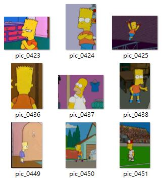  
如下圖所示，pic_0712為分類錯誤之圖片  
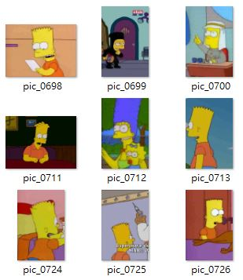  
如下圖所示，pic_1309為分類錯誤之圖片  
  
如下圖所示，pic_0483為分類錯誤之圖片  
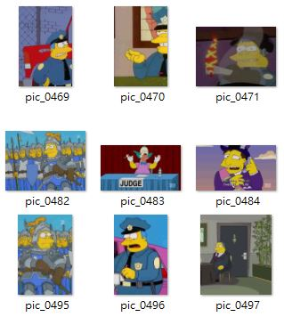  
如下圖所示，pic_0507為分類錯誤之圖片  
  
2. 將每一類各取出20張圖片當作測試集，剩餘的圖片再使用keras的ImageDataGenerator套件進行資料擴增，其擴增方法如下所示，包括了使用圖片旋轉、水平平移、垂直平移、映射、縮放、水平翻轉等等的資料擴增方法。
```
datagen = ImageDataGenerator(rotation_range=15,
                             width_shift_range=0.1,
                             height_shift_range=0.1,
                             shear_range=0.1,
                             zoom_range=[1, 1.2],
                             fill_mode="wrap",
                             horizontal_flip=True,
                             vertical_flip=False)
```
3. 將每一類擴增到3500張，再隨機取出每類的3000張圖片當作訓練集，500張當作測試集，擴增後之資料集如下所示。
 

## 模型架構
1. 本次訓練使用基於ResNet101改進的架構ResNext101架構，其整體網路架構與ResNet101極為相似，ResNet架構圖如下所示。  
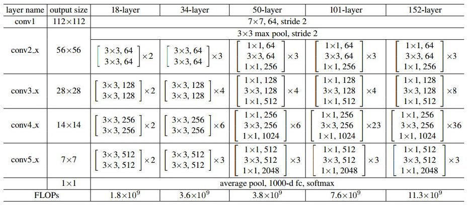  
2. ResNext與ResNet最大的不同之處在於將模型進行橫向加寬，進而提升模型效能。  
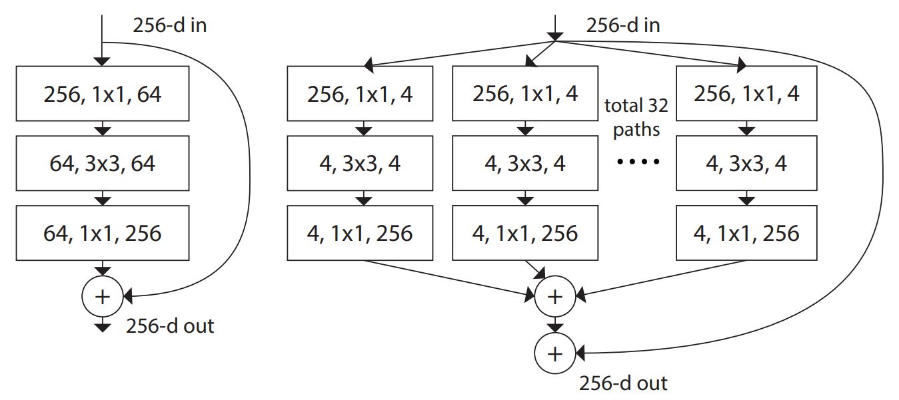  
## 訓練設置
1. 本次深度學習框架使用的是PyTorch框架。讀取resnext101_32x8d模型後，再讀取pytorch官方已經訓練過的預訓練權重，並使用深度學習最常使用的freeze方法，將前面幾層設定為不可訓練，後面幾層設定為可以訓練，達到高效率學習的方法，詳細freeze程式碼如下所示。可以看到可訓練模型參數從86,783,316降低為28,786,708，可以大幅降低模型訓練的時間，並且使用遷移學習的方法使效果更加顯著。
```
# 將特定層設定為不可訓練
for name, param in model.named_parameters():
    if name == 'layer4.0.conv1.weight':
        break
    param.requires_grad = False
# 輸出模型參數
summary(model.to(device), (3, 224, 224))
>>>
                                .
                                .
                                .
          Conv2d-314           [-1, 2048, 7, 7]       1,179,648
     BatchNorm2d-315           [-1, 2048, 7, 7]           4,096
            ReLU-316           [-1, 2048, 7, 7]               0
          Conv2d-317           [-1, 2048, 7, 7]       4,194,304
     BatchNorm2d-318           [-1, 2048, 7, 7]           4,096
          Conv2d-319           [-1, 2048, 7, 7]       2,097,152
     BatchNorm2d-320           [-1, 2048, 7, 7]           4,096
            ReLU-321           [-1, 2048, 7, 7]               0
      Bottleneck-322           [-1, 2048, 7, 7]               0
          Conv2d-323           [-1, 2048, 7, 7]       4,194,304
     BatchNorm2d-324           [-1, 2048, 7, 7]           4,096
            ReLU-325           [-1, 2048, 7, 7]               0
          Conv2d-326           [-1, 2048, 7, 7]       1,179,648
     BatchNorm2d-327           [-1, 2048, 7, 7]           4,096
            ReLU-328           [-1, 2048, 7, 7]               0
          Conv2d-329           [-1, 2048, 7, 7]       4,194,304
     BatchNorm2d-330           [-1, 2048, 7, 7]           4,096
            ReLU-331           [-1, 2048, 7, 7]               0
      Bottleneck-332           [-1, 2048, 7, 7]               0
          Conv2d-333           [-1, 2048, 7, 7]       4,194,304
     BatchNorm2d-334           [-1, 2048, 7, 7]           4,096
            ReLU-335           [-1, 2048, 7, 7]               0
          Conv2d-336           [-1, 2048, 7, 7]       1,179,648
     BatchNorm2d-337           [-1, 2048, 7, 7]           4,096
            ReLU-338           [-1, 2048, 7, 7]               0
          Conv2d-339           [-1, 2048, 7, 7]       4,194,304
     BatchNorm2d-340           [-1, 2048, 7, 7]           4,096
            ReLU-341           [-1, 2048, 7, 7]               0
      Bottleneck-342           [-1, 2048, 7, 7]               0
AdaptiveAvgPool2d-343           [-1, 2048, 1, 1]               0
          Linear-344                   [-1, 20]          40,980
================================================================
Total params: 86,783,316
Trainable params: 28,786,708
Non-trainable params: 57,996,608
----------------------------------------------------------------
Input size (MB): 0.57
Forward/backward pass size (MB): 772.53
Params size (MB): 331.05
Estimated Total Size (MB): 1104.16
----------------------------------------------------------------
```
2. 訓練之損失函數選擇使用CrossEntropy，優化器選擇Adam，學習率設置1e-4，共訓練10個Epochs。

## 結果分析

1. 訓練過程如下，在第8個Epoch的loss下降至0.013188，為10個epochs當中訓練損失函數最低的，且在訓練準確率達到了1。  
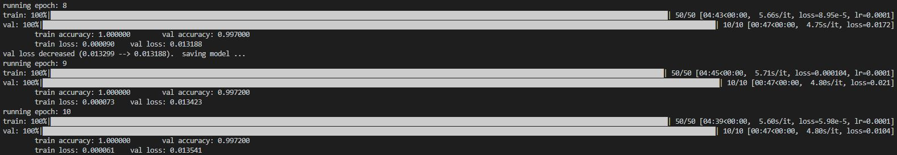  
2. 訓練之準確率如下圖所示。  
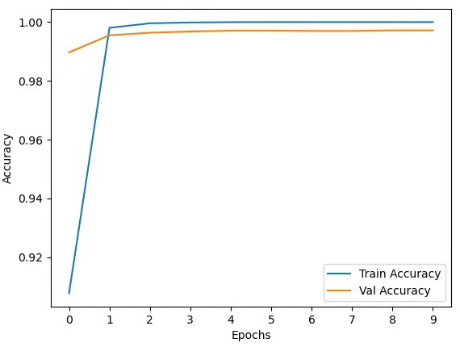  
3. 訓練之損失如下圖所示。  
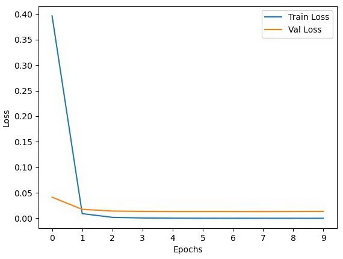  
4. 將測試集丟如模型進行預測，所輸出之混淆矩陣如下圖所示。  
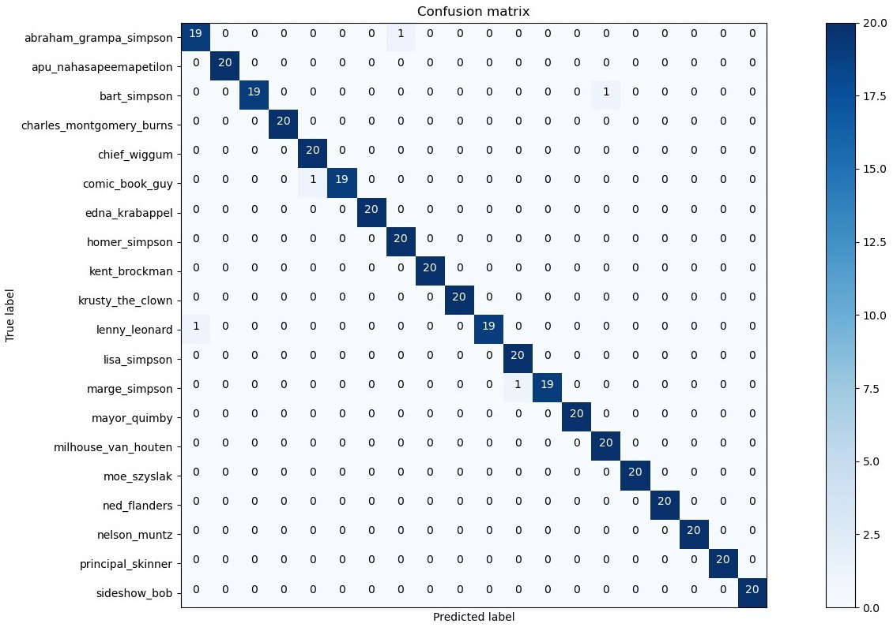  
5. 將第一層的Filter與第三層的Filter可視化。第一層Filter如下圖所示。  
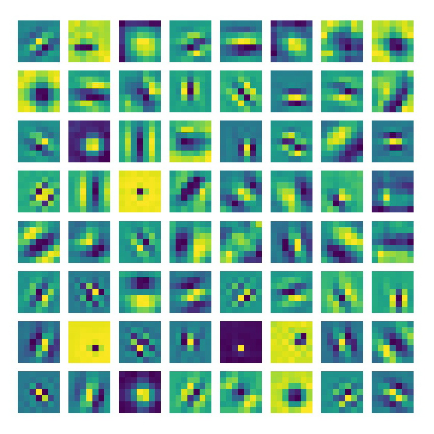  
第二層Filter如下圖所示。  
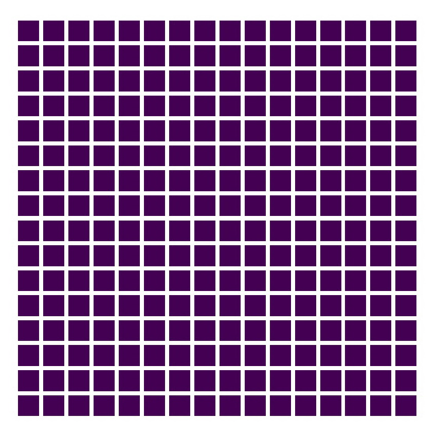  
第三層Filter如下圖所示。  
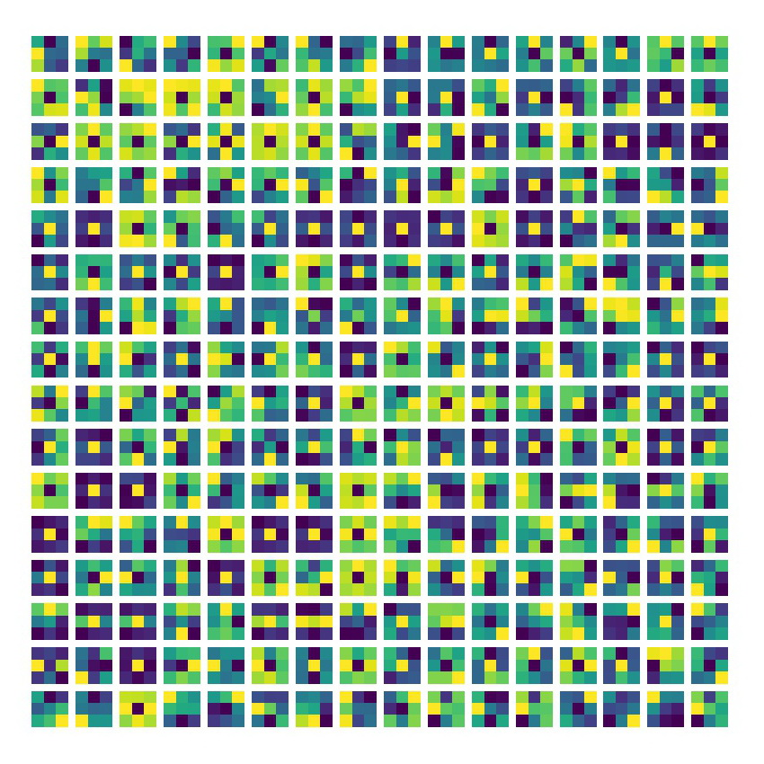  
6. 將第一層與第二層的Feature map可視化。第一層輸出之Feature map如下圖所示。  
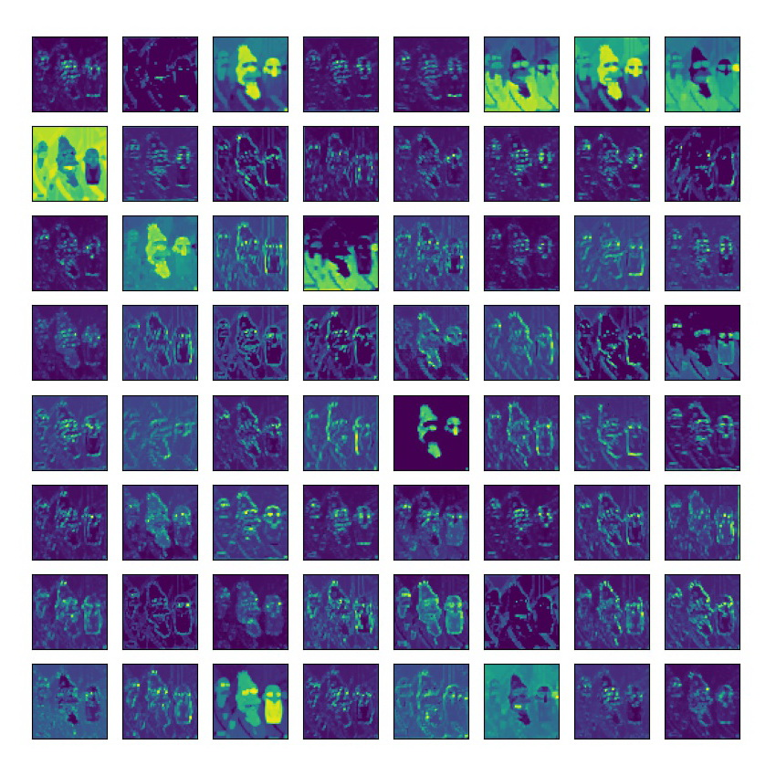  
第二層輸出之Feature map如下圖所示。  
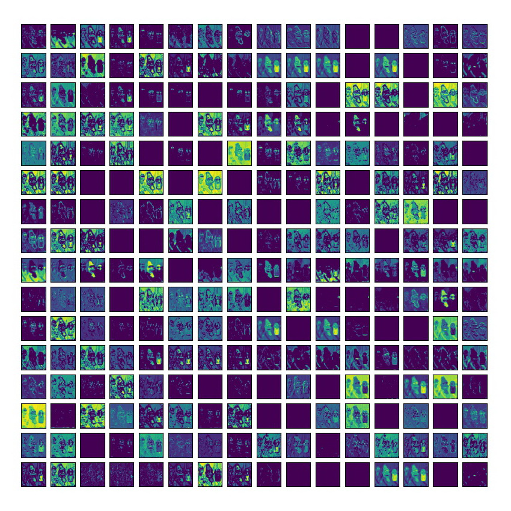  
第三層輸出之Feature map如下圖所示。  
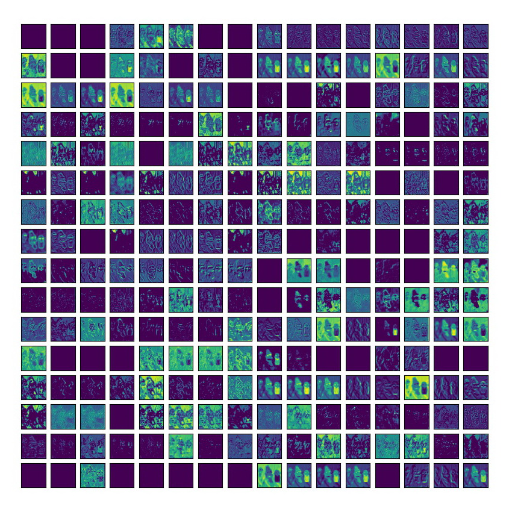  
## 後續改進

1. 若需要更好的預測效果，可以將本次使用的模型ResNext101的32*8d更改為32*16d，甚至是32*48d，讓學習效果更好，或者是不要使用冷凍方法，將前面幾層設定為可以訓練，但會減少batch_size設定的數值，以及大幅提高訓練所需的時間。

## 參考資料

1. ##### PyTorch-練習kaggle-Dogs vs Cats-使用自定義的 CNN model @[LiDo @lido2370](https://hackmd.io/@lido2370/S1aX6e1nN?type=view)
2. ##### pytorch圖像分類篇：2.pytorch官方demo實現一個分類器(LeNet) @[Fun'](https://blog.csdn.net/m0_37867091/article/details/107136477)
3. ##### pytorch使用hook打印中間特徵圖、計算網路算力等 @[涩醉](https://zhuanlan.zhihu.com/p/73868323)